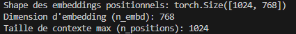
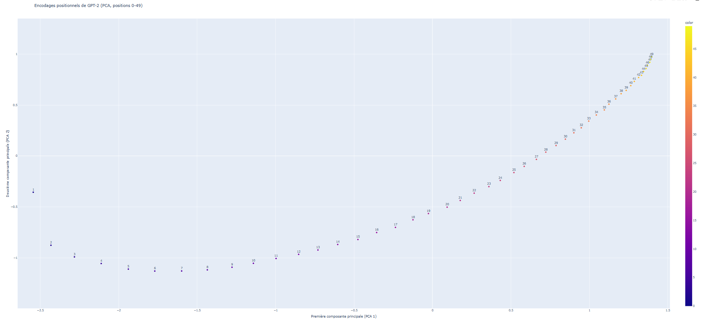
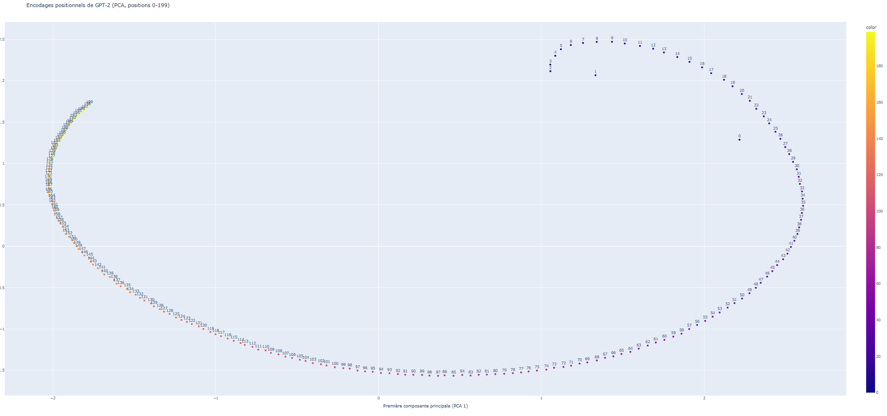
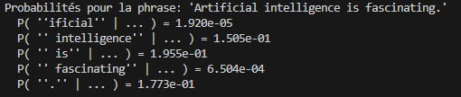
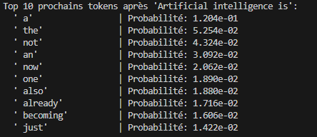

# Rapport TP1
## Exercice 1: Découverte du tokenizer GPT-2


### Tokenisation de la phrase "Artificial intelligence is metamorphosing the world!"

**Liste de tokens:**

```
Tokens: ['Art', 'ificial', 'Ġintelligence', 'Ġis', 'Ġmet', 'amorph', 'osing', 'Ġthe', 'Ġworld', '!']
```

**Explication du symbole 'Ġ':**
On remarque que certains tokens comme `Ġintelligence` commencent par un symbole spécial, `Ġ`. Ce n'est pas une erreur : c'est simplement la façon dont le tokenizer de GPT-2 représente un espace. Il le "colle" au début du mot qui le suit. Ça lui permet de faire la différence entre un mot qui est en début de phrase (comme `Art`) et un mot qui se trouve au milieu (comme ` intelligence`).

**Capture d'écran d'une exécution (à ajouter ici):**
(Veuillez insérer ici une capture d'écran de l'exécution de `TP1/ex1_tokenizer.py` dans votre terminal ou notebook.)

### Identifiants (Token IDs) et décodage individuel

**Sortie du programme (Token IDs et détails):**

```
Token IDs: [8001, 9542, 4430, 318, 1138, 37670, 2752, 262, 995, 0]

Détails par token (Token -> ID -> Décodage):
- ID: 8001  | Token: 'Art'                | Décodé: 'Art'
- ID: 9542  | Token: 'ificial'            | Décodé: 'ificial'
- ID: 4430  | Token: 'Ġintelligence'      | Décodé: ' intelligence'
- ID: 318   | Token: 'Ġis'                | Décodé: ' is'
- ID: 1138  | Token: 'Ġmet'               | Décodé: ' met'
- ID: 37670 | Token: 'amorph'             | Décodé: 'amorph'
- ID: 2752  | Token: 'osing'              | Décodé: 'osing'
- ID: 262   | Token: 'Ġthe'               | Décodé: ' the'
- ID: 995   | Token: 'Ġworld'             | Décodé: ' world'
- ID: 0     | Token: '!'                  | Décodé: '!'
```

**Tableau des tokens, IDs et remarques:**

| Token                     | ID    | Remarque                     |
| :------------------------ | :---- | :--------------------------- |
| `Art`                     | 8001  | Début de mot                 |
| `ificial`                 | 9542  | Partie de mot                |
| `Ġintelligence`           | 4430  | Mot complet avec espace      |
| `Ġis`                     | 318   | Mot complet avec espace      |
| `Ġmet`                    | 1138  | Début de mot avec espace     |
| `amorph`                  | 37670 | Partie de mot                |
| `osing`                   | 2752  | Fin de mot                   |
| `Ġthe`                    | 262   | Mot complet avec espace      |
| `Ġworld`                  | 995   | Mot complet avec espace      |
| `!`                       | 0     | Ponctuation                  |

**Différence entre tokens et token IDs:**
La différence est assez simple : un **token** est le morceau de texte lui-même (ex: `'Ġis'` ou `'amorph'`). C'est lisible par nous. Le **token ID**, lui, est juste un numéro qui correspond à ce token (ex: `318` pour `'Ġis'`). Le modèle, lui, ne travaille qu'avec ces numéros. C'est sa façon de "lire" la phrase.

### Observations sur le découpage des tokens

**Remarques:**

1.  **Gestion des espaces et des mots courants:** Les espaces sont souvent intégrés au début des mots qui les suivent (ex: `Ġintelligence`, `Ġis`, `Ġthe`). Ça permet de garder l'information sur l'espacement et de créer des "blocs" fréquents qui incluent l'espace. Les mots très courants (comme 'is', 'the', 'world') sont généralement des tokens à part entière, souvent avec le 'Ġ' devant.
2.  **Découpage des mots rares/longs (BPE):** Les mots moins fréquents ou plus longs (comme `metamorphosing`) sont cassés en morceaux plus petits et plus courants (`Ġmet`, `amorph`, `osing`). C'est la magie du BPE : gérer un vocabulaire potentiellement énorme avec un ensemble de tokens pas trop grand, en réutilisant des fragments qu'il connaît bien.
3.  **Gestion de la ponctuation:** La ponctuation (comme `!`) est en général traitée comme un token séparé. C'est plus flexible pour le modèle pour comprendre la structure de la phrase.

**Lien avec BPE / sous-mots / réutilisation de fragments fréquents:**
Ces observations, c'est vraiment le cœur du BPE. Le BPE cherche le meilleur compromis entre avoir un petit dictionnaire de mots et ne pas avoir des phrases tokenisées trop longues. Il fusionne les paires de caractères ou de sous-mots qui reviennent le plus souvent pour créer de nouveaux tokens. Comme ça, les mots courants deviennent des tokens uniques (réutilisation), et les mots rares ou longs sont construits à partir de ces "briques" plus petites. Le modèle peut ainsi comprendre un mot complexe même s'il ne l'a jamais vu entier.

### Expérimentation avec la phrase "GPT models use BPE tokenization to process unusual words like antidisestablishmentarianism."

**Sortie du programme (tokens pour la phrase 2):**

```
Tokens pour la phrase 2: ['G', 'PT', 'Ġmodels', 'Ġuse', 'ĠB', 'PE', 'Ġtoken', 'ization', 'Ġto', 'Ġprocess', 'Ġunusual', 'Ġwords', 'Ġlike', 'Ġant', 'idis', 'establishment', 'arian', 'ism', '.']
```

**Découpage du mot "antidisestablishmentarianism":**

```
Le mot 'antidisestablishmentarianism' est découpé en 5 sous-tokens:
['Ġant', 'idis', 'establishment', 'arian', 'ism']
```

**Nombre de sous-tokens pour "antidisestablishmentarianism":** 5

**Explication du découpage de ce mot long:**
Pourquoi "antidisestablishmentarianism" est-il découpé en cinq morceaux ? C'est tout l'intérêt du BPE. Au lieu d'avoir un vocabulaire géant avec tous les mots possibles (y compris les plus rares comme celui-ci), le tokenizer est plus malin. Il le casse en fragments qu'il connaît déjà (`Ġant`, `idis`, `establishment`, `arian`, `ism`). Ça lui permet de comprendre un mot qu'il n'a peut-être jamais vu en entier, juste en assemblant ses "briques" de base. Ça rend le modèle plus polyvalent !

## Exercice 2: Analyse des encodages positionnels dans GPT-2

### Extraction des encodages positionnels et configuration



**Interprétation de la "shape":**
La "shape" `torch.Size([1024, 768])` nous dit deux choses importantes. Le `1024` représente le nombre maximal de positions que le modèle peut gérer, c'est-à-dire la longueur maximale d'une phrase (ou séquence de tokens) qu'il peut traiter. Le `768`, c'est la dimension de chaque encodage positionnel : chaque position est représentée par un vecteur de 768 nombres. En gros, c'est comme si chaque position avait sa propre "signature" unique de 768 chiffres.

**Signification de `n_positions` pour un modèle causal:**
`n_positions` (ici `1024`) indique la longueur maximale de la séquence que le modèle peut prendre en compte. Pour un modèle causal comme GPT-2 (qui prédit le mot suivant en ne regardant que les mots précédents), c'est la "fenêtre de contexte" maximale. Si une phrase est plus longue que 1024 tokens, le modèle devra en ignorer une partie, car il n'a pas été entraîné pour gérer des positions au-delà de cette limite.

### Visualisation des 50 premières positions avec PCA



**Description des observations (5-10 lignes):**
On voit que les positions (0 à 49) ne sont pas dispersées au hasard : elles suivent presque toutes une même trajectoire continue, comme une courbe. En avançant dans les numéros (et dans la couleur), les points progressent de façon régulière le long de cette courbe, sans vrais “sauts” ni groupes séparés. La forme est globalement courbée : au début ça descend vers des valeurs plus négatives, puis ça remonte progressivement jusqu’en haut à droite. Vers la fin, les points sont plus serrés, ce qui donne l’impression que les encodages changent un peu moins (au moins dans ces deux composantes).

**Intérêt de la PCA ici:**
La PCA (Analyse en Composantes Principales) est super utile ici car nos encodages positionnels sont des vecteurs très longs (768 dimensions). Nos yeux ne peuvent pas visualiser ça. La PCA nous permet de "compresser" cette information complexe en seulement 2 dimensions (les deux "axes" les plus importants), tout en essayant de garder un maximum de la variation originale. Ça nous donne une idée de la structure des données sans perdre la tête avec les 768 dimensions !

### Visualisation des 200 premières positions avec PCA




**Comparaison 0-50 vs 0-200 et hypothèse:**

Sur 0–50, on voit une trajectoire lisse (une portion d’arc) : les positions se suivent sans saut, et les points voisins sont proches. 
Quand on passe à 0–200, ce même mouvement continue mais “s’enroule” : la trajectoire devient une grande boucle quasi circulaire, comme si 0–50 n’était qu’un petit morceau de cette courbe globale. La structure est même plus nette à grande échelle (on distingue très bien un unique chemin ordonné), mais elle paraît aussi plus “complexe” car la projection PCA 2D fait revenir certaines positions éloignées près l’une de l’autre sur la boucle. Ça suggère que le modèle code la position de façon continue et régulière (positions proches → encodages similaires), avec une structure quasi périodique / en phase : en avançant, on s’éloigne progressivement… tout en pouvant se rapprocher à nouveau dans cette projection 2D.

## Exercice 3: Probabilités de génération et perplexité

### Calcul des probabilités conditionnelles

**Sortie:**




**Explication de l'alignement (t-1):**
Pour un modèle comme GPT-2, la prédiction se fait toujours un cran en avance. Quand le modèle a lu les tokens de 0 à `t-1`, il essaie de deviner le token `t`. Les `logits` à la position `t-1` dans le tenseur de sortie contiennent donc la distribution de probabilité pour tous les mots possibles du vocabulaire *pour la position suivante, la position `t`*. C'est pour ça que pour connaître la probabilité que le modèle a bien attribué au token `t` qui a été réellement observé, on doit regarder dans la sortie de la prédiction faite juste avant, à la position `t-1`.

### Calcul de la log-probabilité et de la perplexité

**Sorties du programme:**
```
'Artificial intelligence is fascinating.'
  Log-probabilité totale: -23.45
  Perplexité: 108.96

'Artificial fascinating intelligence is.'
  Log-probabilité totale: -42.16
  Perplexité: 4595.92

'L'intelligence artificielle est fascinante.'
  Log-probabilité totale: -59.48
  Perplexité: 383.04
```

**Que mesure la perplexité ?**
La perplexité, c'est une mesure de l'incertitude du modèle face à une phrase. De manière intuitive, on peut la voir comme le "nombre de choix" que le modèle hésite en moyenne à chaque étape pour prédire le mot suivant. Une perplexité basse (proche de 1) signifie que le modèle est très confiant et surpris par rien dans la phrase ; il la trouve très "logique". Une perplexité élevée signifie que le modèle est très "perplexe" : la phrase lui semble improbable, et il a du mal à la prédire.

**Comparaison des perplexités (Anglais vs. Français):**
On voit que la perplexité de la phrase grammaticalement correcte en anglais (`108.96`) est beaucoup plus faible que celle de la phrase "brouillée" (`4595.92`). C'est normal : le modèle a été entraîné sur d'immenses quantités de texte anglais correct. Il a donc appris que "intelligence is fascinating" est une séquence beaucoup plus probable que "fascinating intelligence is". La phrase en français a une perplexité (`383.04`) plus élevée que la phrase anglaise correcte, mais bien plus faible que la phrase incorrecte. Le modèle GPT-2 de base a été entraîné majoritairement sur de l'anglais, il "connaît" donc un peu de français mais il est bien moins à l'aise avec, d'où sa plus grande "perplexité".

### Top 10 des tokens suivants

**Sortie du programme:**



**Commentaire:**
Les propositions sont tout à fait plausibles. Après "Artificial intelligence is", le modèle s'attend à trouver des articles (`a`, `the`, `an`), des adverbes (`not`, `now`, `also`, `already`, `just`), ou des verbes qui introduisent un état (`becoming`). C'est exactement ce qu'on trouverait dans du vrai texte. On note la présence de tokens qui commencent par un espace (`' a'`, `' the'`, etc.), ce qui est logique puisque le mot suivant serait séparé par un espace.

## Exercice 4: Méthodes de génération de texte

### Setup

**Seed utilisé et pourquoi on le fixe:**
Le seed utilisé est `42`. On fixe un seed pour assurer la reproductibilité des résultats. Pour toutes les méthodes de génération qui incluent de l'aléatoire (comme l'échantillonnage), le fait de fixer le seed garantit que si on relance le code avec le même seed, on obtiendra exactement la même séquence de nombres aléatoires et donc les mêmes textes générés. C'est crucial pour pouvoir analyser et comparer les résultats de manière fiable.

### Décodage glouton (Greedy decoding)

**Texte généré:**
```
Setting `pad_token_id` to `eos_token_id`:50256 for open-end generation.
The future of artificial intelligence is uncertain.

"We're not sure what the future will look like," said Dr. Michael S. Schoenfeld, a professor of computer science at the University of California, Berkeley. "But we're not
```

**Relance 3 fois : est-ce identique ? Explication:**
Oui, si on relance la génération en mode glouton (greedy) plusieurs fois avec les mêmes paramètres, le texte généré sera toujours identique. Le décodage glouton choisit systématiquement le token avec la probabilité la plus élevée à chaque étape. Il n'y a aucune part d'aléatoire dans ce processus. Donc, pour un prompt donné, le chemin de génération est déterministe et unique.

**Capture d'écran d'une exécution (à ajouter ici):**
(Veuillez insérer ici une capture d'écran de l'exécution de cette partie du code.)

### Échantillonnage (Sampling) : température, top-k, top-p

**Exemple de sorties différentes (SEED 1 et SEED 2):**
```
SEED 1:
The future of artificial intelligence is up in the air, and the future of artificial intelligence is now about to change. For now, we're just waiting for the technology to be perfected so that we can take it to the next level.

The
----------------------------------------
SEED 2:
The future of artificial intelligence is not clear, but that could change. The early progress of AI has been largely due to the ability to do some things fairly quickly, like calculate things, but the future is not clear. The early progress of AI has
----------------------------------------
```

**Comparaison au greedy : diversité, cohérence, répétitions:**
Contrairement au décodage glouton qui est déterministe, l'échantillonnage produit des textes différents à chaque fois (quand le seed change). On observe une bien plus grande diversité dans les générations. Le texte peut parfois être un peu moins cohérent sur la très longue durée que le greedy, qui a tendance à rester sur des chemins très "sûrs". Par contre, l'échantillonnage, surtout sans pénalité de répétition, peut avoir tendance à répéter des phrases ou des idées, comme on le voit dans la sortie du `SEED 1` ("The future of artificial intelligence is...").

**Explication qualitative du rôle de température / top-k / top-p:**
*   **Température:** Contrôle la "créativité" du modèle. Une température élevée rend la distribution des probabilités plus "plate", donnant plus de chances aux tokens moins probables d'être choisis, ce qui mène à des textes plus surprenants et divers. Une température basse concentre les probabilités sur les tokens les plus probables, rendant le texte plus prévisible et "sûr".
*   **Top-K:** Limite le nombre de tokens considérés pour l'échantillonnage aux `K` tokens les plus probables. Si `K=50`, seuls les 50 mots les plus probables sont pris en compte pour le tirage aléatoire, évitant ainsi des mots complètement hors de propos.
*   **Top-P (ou nucleus sampling):** Similaire à Top-K, mais au lieu de fixer un nombre `K`, on choisit le plus petit ensemble de tokens les plus probables dont la somme des probabilités dépasse `P`. Cela permet de s'adapter dynamiquement à la forme de la distribution : si peu de mots sont très probables, on en prend peu ; si beaucoup de mots ont des probabilités similaires, on en prend plus.

### Pénalité de répétition élevée (`repetition_penalty=2.0`)

**Sortie "sans pénalité" (répétition du seed 1 de la partie 3):**
```
The future of artificial intelligence is up in the air, and the future of artificial intelligence is now about to change. For now, we're just waiting for the technology to be perfected so that we can take it to the next level.

The
```

**Sortie "avec pénalité" (seed 1, `repetition_penalty=2.0`):**
```
The future of artificial intelligence is up in the air, and it may not be as interesting or useful to us humans. But we're going down a path where our ability for thinking about things could become less important than ever before."
 (Photo:
```

**Commentaire : observe-t-on moins de répétitions ? Y a-t-il des effets secondaires ?**
Oui, on observe clairement moins de répétitions avec la pénalité. La génération "sans pénalité" répète plusieurs fois "the future of artificial intelligence is", tandis que la version "avec pénalité" réussit à diversifier le discours. L'effet secondaire potentiel est que le texte pourrait devenir légèrement moins naturel ou cohérent si la pénalité est trop forte, forçant le modèle à utiliser des mots moins pertinents pour éviter des répétitions "normales" (comme des articles ou prépositions). Ici, l'effet est positif.

### Température très basse (0.1) puis très élevée (2.0)

**Sortie pour `temp=0.1` (seed 1):**
```
Génération avec Température très BASSE (0.1, Seed 1):
The future of artificial intelligence is uncertain. But the future of artificial intelligence is not.

The future of artificial intelligence is not.

The future of artificial intelligence is not.

The future of artificial intelligence is not.

The
```

**Sortie pour `temp=2.0` (seed 1):**
```
Génération avec Température très ÉLEVÉE (2.0, Seed 1):
The future of artificial intelligence is up in the air again in 2014 as Google unveils its new platform called MachineStory-AI called Watson from the Stanford Institute for Artificial Intelligence (SetBorg). For IBM and for everyone trying to get their heads in
```

**Explication du compromis "cohérence vs diversité":**
*   **Température très basse (0.1):** Le modèle devient extrêmement conservateur, presque glouton. Il choisit presque toujours le token le plus probable. Cela conduit à un texte très cohérent et prévisible, mais avec une diversité très faible et une forte tendance à la répétition (boucles), comme "The future of artificial intelligence is not." répété plusieurs fois.
*   **Température très élevée (2.0):** Le modèle devient très "créatif" mais perd en cohérence. Il explore des tokens moins probables, ce qui peut donner des résultats inattendus et parfois amusants, mais qui peuvent rapidement devenir chaotiques et sans lien logique, comme une succession d'idées décousues. Le compromis est donc entre la fluidité et la prévisibilité d'un côté (basse température) et l'originalité mais le risque d'incohérence de l'autre (haute température).

### Génération avec beam search (`num_beams=5`)

**Sortie beam search (`num_beams=5`):**
```
Avec num_beams=5:
The future of artificial intelligence is in the hands of the next generation of scientists and engineers.

The future of artificial intelligence is in the hands of the next generation of scientists and engineers.   

The future of artificial intelligence is in the hands of
```

**Comparaison qualitative : "plus probable globalement", "plus générique", "moins divers":**
Le beam search (`num_beams=5`) tend à produire des textes qui sont considérés comme "plus probables globalement" car il explore plusieurs chemins simultanément et choisit le meilleur sur l'ensemble de la séquence, pas juste le prochain token. Le résultat est souvent plus cohérent et grammaticalement correct que le décodage glouton, et moins aléatoire que l'échantillonnage. Cependant, il est souvent "plus générique" ou "moins divers", car il privilégie les séquences les plus probables, ce qui peut le faire converger vers des phrases très communes ou même des répétitions si une séquence très probable mène à une boucle.

### Performance du Beam Search

**Temps mesurés et paramètres:**
```
Temps de génération pour num_beams=5: 1.0815 secondes
Temps de génération pour num_beams=10: 1.2144 secondes
Temps de génération pour num_beams=20: 1.6738 secondes

Récapitulatif des temps:
  num_beams=5: 1.0815s
  num_beams=10: 1.2144s
  num_beams=20: 1.6738s
```

**Explication pourquoi cela ralentit (complexité / exploration de chemins):**
On constate clairement que le temps de génération augmente avec le nombre de beams. C'est tout à fait logique. Le beam search explore `num_beams` chemins de génération potentiels en parallèle à chaque étape. Si `num_beams` est égal à 5, il garde les 5 meilleures séquences partielles et essaie d'étendre chacune d'elles. Si `num_beams` passe à 10 ou 20, le modèle doit faire bien plus de calculs : il évalue plus de possibilités, trie davantage de séquences, et maintient plus d'états en mémoire. Cette augmentation de la complexité de l'exploration des chemins (arbres de recherche) se traduit directement par un temps de calcul plus long.
