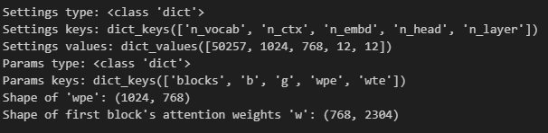

# CSC 8614 — Language Models  
## CI2 — Fine-tuning a language model for text classification (Spam Detection)  
**TP2 / rapport.md**

---

## 1) En-tête (Reproductibilité)

- **Nom / Prénom :** Ahmed Ben Taleb Ali
- **Machine / OS :** Windows 11
- **Version Python :** 3.12.10
- **Commande d’installation / activation d’environnement :**  
  ```bash
  pip install -r TP2/requirements.txt
  ```
- **Versions des bibliothèques principales :**  
  - torch : 2.9.1
  - tensorflow : 2.20.0
  - tiktoken : 0.12.0
  - pandas : 2.3.3
  - matplotlib : 3.10.8

- **Seed fixée :** `random_state=123` (shuffle du dataset)

---

## 2) Modèle : chargement des poids GPT-2

### Question 2 & 3 — Type et structure de `settings` et `params`
- **`settings` Type:** `dict`  
- **`settings` Structure:** Dictionnaire d'hyperparamètres GPT-2.
- **`params` Type:** `dict`
- **`params` Structure:** Dictionnaire contenant les poids du modèle.

> **Sortie observée  :**  
```txt
Type of settings: <class 'dict'>
Structure of settings:
Dictionary with 5 keys:
    - n_vocab: 50257
    - n_ctx: 1024
    - n_embd: 768
    - n_head: 12
    - n_layer: 12

Type of params: <class 'dict'>
Structure of params:
Dictionary with 5 keys:
    - blocks: type=list
    - b: type=ndarray, shape=(768,)
    - g: type=ndarray, shape=(768,)
    - wpe: type=ndarray, shape=(1024, 768)
    - wte: type=ndarray, shape=(50257, 768)
```



### Question 4
The parametre cfg  :

vocab_size (from settings: n_vocab)
emb_dim (from settings: n_embd)
context_length (from settings: n_ctx)
drop_rate (already provided: 0.1)
n_layers (from settings: n_layer)
n_heads (from settings: n_head)
qkv_bias (already provided: True)
---
## 3) Préparation des données


### Question 5.1
La ligne df = df.sample(frac=1, random_state=123) mélange le jeu de données de manière aléatoire avant de le diviser en ensembles d’entraînement et de test.
frac=1 signifie que l’on utilise 100 % des données.
random_state=123 garantit la reproductibilité

### Question 5.2 — Distribution des classes
- **Distribution:** Le jeu de données est déséquilibré.
- **Interprétation:** Le déséquilibre peut entraîner un modèle biaisé vers la classe majoritaire ('ham'), ce qui peut nuire à la performance sur la classe minoritaire ('spam').

> **Sortie observée (copie) :**  
```txt
Class distribution in training set:
Label
ham     3860
spam     597
Name: count, dtype: int64
```


### Question 7 — Nombre de lots (batches)

> **Sortie observée (copie) :**  
```txt
Training data size: 4457 samples
Batch size: 16
Number of batches per epoch: 279
Verification using len(train_loader): 279
```

---
## 4) Fine-tuning

### Question 8 — Remplacement de la tête de sortie

> **Sortie observée (copie) :**  
```txt
Original output head: Linear(in_features=768, out_features=50257, bias=False)
New output head: Linear(in_features=768, out_features=2, bias=True)
```

### Question 9 & 10 — Entraînement et analyse
- **Tendance de la perte (loss) :** La perte diminue globalement au fil des époques, avec des fluctuations.
- **Apprentissage du modèle :** Le modèle apprend avec succès à classifier les spams, comme le montre l'augmentation de la `Spam Acc` (précision sur les spams), qui atteint plus de 90% à la fin de l'entraînement.

> **Sortie observée (copie) :**  

```
Epoch 1, Batch 0, Loss: 1.9061
...
Epoch 1: Train Acc: 86.49% (Spam: 0.00%) | Test Acc: 86.37% (Spam: 0.00%)
...
Epoch 2, Batch 0, Loss: 0.7695
...
Epoch 2: Train Acc: 87.59% (Spam: 30.82%) | Test Acc: 87.71% (Spam: 28.00%)
...
Epoch 3, Batch 0, Loss: 0.7446
...
Epoch 3: Train Acc: 80.41% (Spam: 90.45%) | Test Acc: 81.35% (Spam: 92.67%)
```
