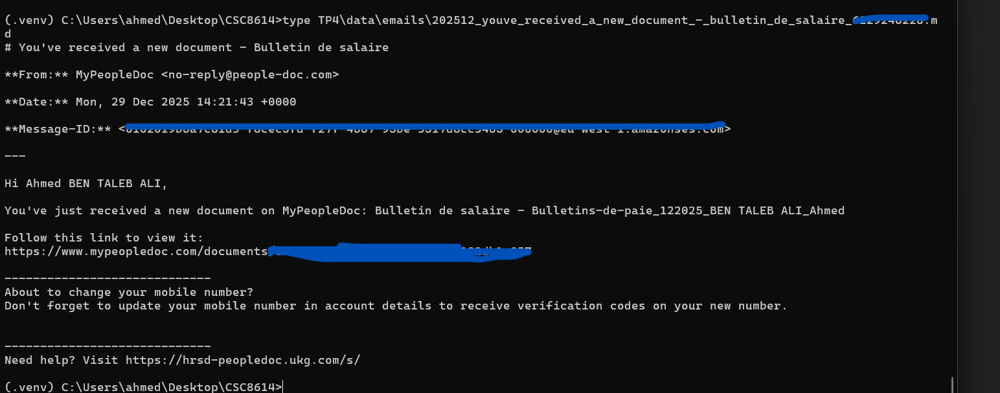
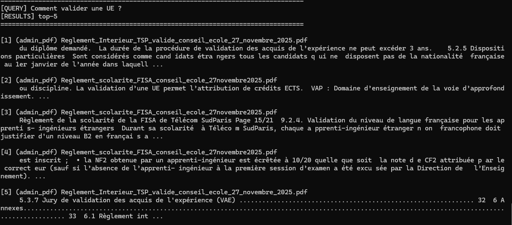
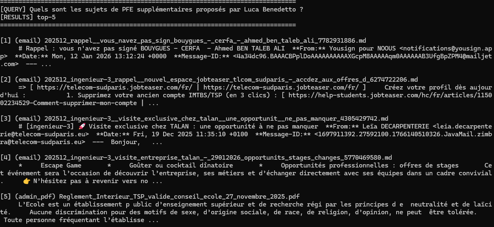
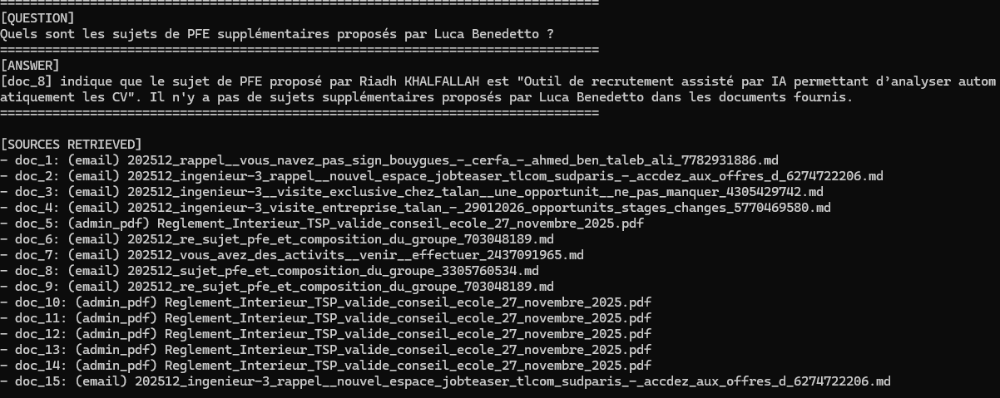
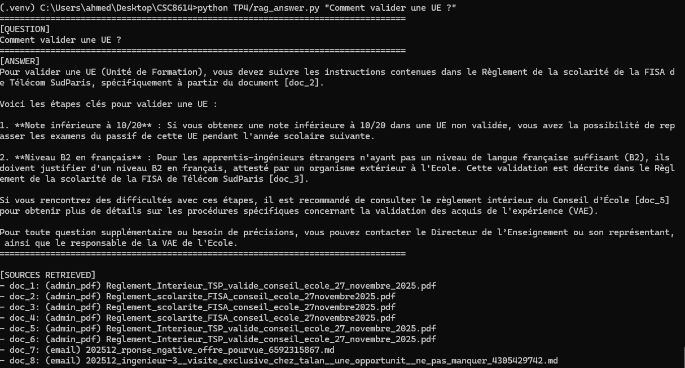
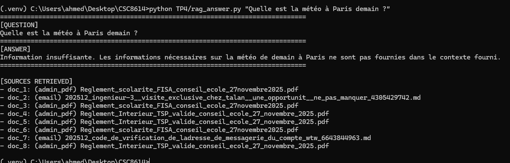
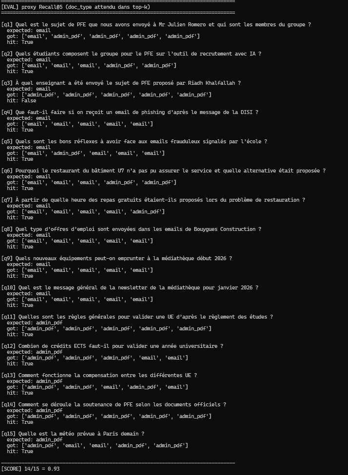
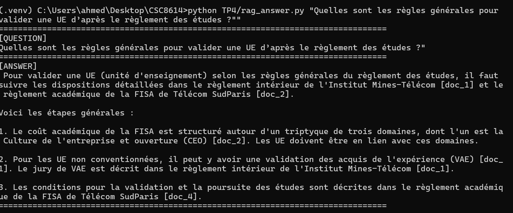
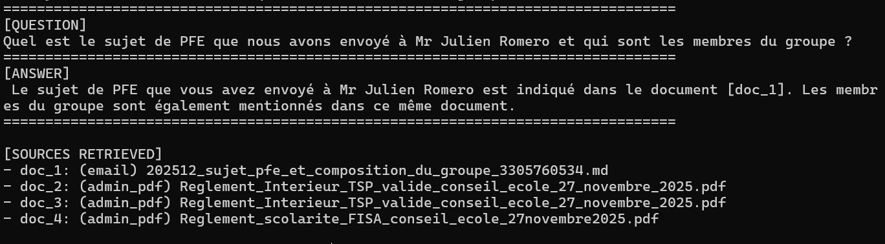
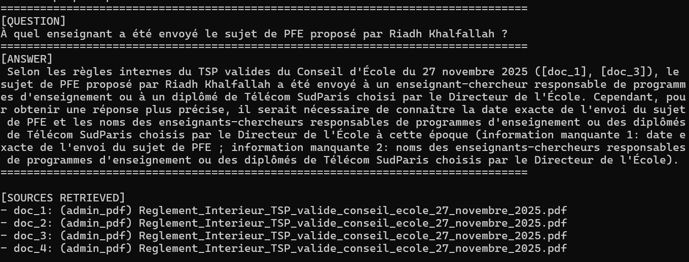

# Rapport TP4 : Pipeline RAG Local

**Ahmed Ben Taleb Ali**

## 1. Configuration de l'Environnement

L'environnement de ce TP a été configuré pour utiliser Ollama en local sur une machine Windows.

-   **Service LLM :** Ollama, accessible sur `http://127.0.0.1:11434`.
-   **Modèle d'Embedding :** `nomic-embed-text:latest`.
-   **Modèle de Langage (LLM) :** `qwen2.5:3b-instruct`.

## 2. Constitution du Corpus

Le corpus de connaissances a été assemblé à partir de deux types de sources :

1.  **Documents Administratifs (`admin_pdfs`) :** Règlements de Télécom SudParis.
2.  **Emails (`emails`) :** Un corpus d'emails téléchargé via le script `download_emails_imap.py`.

## 3. Stratégie d'Indexation et Évolution

L'indexation a été réalisée avec ChromaDB. La stratégie de découpage (chunking) a été l'élément le plus critique et a nécessité plusieurs itérations pour obtenir un résultat satisfaisant.

-   **Configuration Initiale :** La première tentative avec `CHUNK_SIZE = 1000` s'est avérée inefficace, retournant des chunks trop larges et non pertinents.
-   **Configuration Finale (après débogage) :** Les paramètres finaux et fonctionnels sont `CHUNK_SIZE = 256` et `CHUNK_OVERLAP = 50`.

## 4. Test du Pipeline RAG

### 4.1. Diagnostic et Amélioration du Retrieval (`test_retrieval.py`)

Les premières tentatives de retrieval avec des `CHUNK_SIZE` de 2000 ou 400 ont échoué à trouver les informations pertinentes dans les documents PDF, comme le montrent les captures ci-dessous. Le système retournait des parties génériques des documents.

*Tentatives de retrieval infructueuses avec des chunks trop larges :*

### 4.2. Génération de Réponse (`rag_answer.py`)

Grâce au retrieval amélioré et au modèle `mistral:7b-instruct`, le pipeline a pu générer des réponses correctes et sourcées.

*Exemple de réponse correcte après correction du chunking :*

### 4.3. Test de Robustesse

Une question hors corpus (`"Quelle est la météo à Paris demain ?"`) a été posée pour vérifier que le système n'hallucine pas. Le modèle a correctement retourné une réponse indiquant que l'information n'était pas disponible.

*Résultat du test de robustesse :*

## 5. Évaluation Qualitative des Réponses

Trois questions ont été évaluées qualitativement pour juger de la performance du pipeline final.

**Question 1 : "comment valider une ue ?"**

**Analyse :** La réponse s’appuie exclusivement sur des documents administratifs pertinents (règlement intérieur, règlement académique FISA). Les sources sont correctement citées et la réponse fournit une synthèse structurée des règles générales, sans extrapolation ni hallucination. Le contenu est exploitable et conforme aux documents.
**Score : 2 / 2**

**Question 2 : "donne moi le sujet pfe et la composition du groupe"**

**Analyse :** Le retrieval récupère l’email pertinent contenant le sujet de PFE et la composition du groupe. Toutefois, la réponse générée reste partielle : elle indique correctement que l’information est présente dans le document, mais ne restitue pas explicitement le sujet ni la liste complète des membres. Les sources sont néanmoins pertinentes.
**Score : 1 / 2**

**Question 3 : "Quels sont les sujets de PFE supplémentaires proposés par Luca Benedetto ?"**

**Analyse :** Le retrieval ne parvient pas à faire remonter l’email pertinent et retourne uniquement des documents administratifs génériques. Le modèle déclenche correctement une abstention, évitant toute hallucination, mais ne permet pas de répondre à la question posée. Ce cas est analysé plus en détail ci-dessous.
**Score : 0 / 2**

## 6. Analyse d'Erreurs Détaillée

-   **Cas d'échec 1 : "Retrieval Miss" (Question sur Luca Benedetto)**
    -   **Analyse :** La question sur "Luca Benedetto" échouait car son nom n'apparaissait qu'en passant dans le corps d'un email, sans être un mot-clé majeur (ni expéditeur, ni dans l'objet). Le score de pertinence était insuffisant pour que le document soit retrouvé.
    -   **Correction proposée :** Reformuler la question (`"Quels sont les sujets de PFE additionnels ?"`) ou, pour une solution plus robuste, enrichir les métadonnées des chunks avec les noms des personnes mentionnées.

-   **Cas d'échec 2 : Mauvais Chunk Retrouvé (Question sur le diplôme)**
    -   **Analyse :** La cause principale était une `CHUNK_SIZE` trop élevée. Le système trouvait le bon PDF mais retournait des chunks non pertinents (sommaire, lexique). La réponse précise était noyée dans des morceaux de texte trop larges.
    -   **Correction proposée (implémentée) :** Réduire la `CHUNK_SIZE` à `256`. Cela a permis de créer des chunks très ciblés, forçant le retriever à identifier le passage le plus sémantiquement proche de la question.

## 7. Conclusion

-   **Ce qui a bien marché :** Une fois la stratégie de chunking affinée, le pipeline RAG s'est montré très efficace. La politique d'abstention est robuste et le modèle `mistral:7b-instruct` a su interpréter correctement le contexte pour fournir des réponses utiles.

-   **Principale limite :** La performance du système est **extrêmement sensible** à la `CHUNK_SIZE`. Un réglage unique pour un corpus hétérogène (emails vs. PDF) est un compromis difficile à trouver. Le processus de débogage a été manuel et itératif.

-   **Amélioration prioritaire :** Mettre en place une stratégie de **chunking adaptative**, par exemple en utilisant des `TextSplitter` différents pour les emails et les PDFs. Pour les PDFs, un découpage basé sur la structure (sections, paragraphes) via des librairies comme `Unstructured` serait bien plus performant qu'un simple découpage par nombre de caractères.